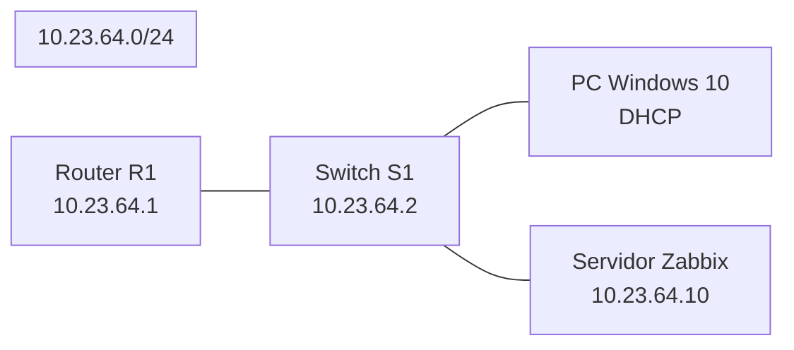

# Laboratorio: Monitoreo de Infraestructura de Red con SNMP y Zabbix

Resumen
-------
Este repositorio documenta un laboratorio de Seguridad Informática para monitorear infraestructura de red (router y switch) usando SNMPv2c y Zabbix. Incluye topología, direccionamiento, configuraciones completas para dispositivos Cisco (R1 y S1), pasos para agregar hosts en Zabbix, verificación desde Windows 10 y recomendaciones de seguridad (incluyendo SNMPv3 como alternativa recomendada).

Diagrama de topología
---------------------
Mermaid (si tu visor lo soporta):



Diagrama ASCII alternativo:

```
           [R1] Fa0/0 10.23.64.1
             |
           e0|
         +---+--------------------+
         |        Switch S1       |
         | VLAN1: 10.23.64.2/24   |
         |  e1 ---> W10 (DHCP)    |
         |  e2 ---> Zabbix (10.23.64.10)
         +------------------------+
```

Tabla de direccionamiento IP
----------------------------

| Dispositivo       | Interfaz / Rol         | IP / Máscara        | Notas                                  |
|-------------------|------------------------|---------------------|----------------------------------------|
| R1 (Router)       | Fa0/0 (gateway/DHCP)   | 10.23.64.1 /24      | Servidor DHCP, SNMPv2c RO: LABRO2364  |
| S1 (Switch)       | VLAN1 (SVI gestión)    | 10.23.64.2 /24      | SNMPv2c RO: LABRO2364                  |
| Servidor Zabbix   | e2                     | 10.23.64.10 /24     | IP estática; recibe traps SNMP        |
| W10 (Windows)     | e1 (cliente DHCP)      | 10.23.64.11–254 (DHCP)| Rango dinámico por DHCP               |
| DHCP pool excluido| —                      | 10.23.64.1–10       | Reservado para R1, S1 y Zabbix        |

Objetivo del laboratorio
------------------------
Monitorear R1 y S1 desde un servidor Zabbix mediante SNMPv2c (solo lectura), y detectar en tiempo real eventos de enlace (linkup/linkdown) mediante traps SNMP. El laboratorio también muestra cómo probar SNMP desde un cliente Windows 10 y comandos de verificación en los dispositivos Cisco.

Configuración completa — Router R1 (Cisco IOS)
----------------------------------------------
Copiar/pegar en la sesión de configuración del router:

```text
! Interfaz y dirección
interface FastEthernet0/0
 ip address 10.23.64.1 255.255.255.0
 no shutdown

! DHCP: excluir direcciones reservadas
ip dhcp excluded-address 10.23.64.1 10.23.64.10

! Pool DHCP
ip dhcp pool POOL_LAN_2364
 network 10.23.64.0 255.255.255.0
 default-router 10.23.64.1
 dns-server 8.8.8.8

! SNMPv2c configuración (solo lectura)
snmp-server community LABRO2364 RO
snmp-server location "Lab-Seguridad-2364"
snmp-server contact "Autor 2364 <autor@example.local>"

! Traps SNMP hacia servidor Zabbix (SNMPv2c)
snmp-server host 10.23.64.10 version 2c LABRO2364
snmp-server enable traps snmp linkdown linkup coldstart warmstart

! (Opcional) mostrar configuración relacionada:
! show running-config | section snmp
```

Configuración completa — Switch S1 (Cisco IOS)
---------------------------------------------
Copiar/pegar en la sesión de configuración del switch:

```text
! SVI de gestión
interface Vlan1
 ip address 10.23.64.2 255.255.255.0
 no shutdown

! Puerta de enlace por defecto para la gestión local
ip default-gateway 10.23.64.1

! Asignar puertos en modo access (ejemplo)
interface range Ethernet0/1
 switchport mode access
 switchport access vlan 1
!
interface range Ethernet0/2
 switchport mode access
 switchport access vlan 1

! SNMPv2c configuración (solo lectura)
snmp-server community LABRO2364 RO
snmp-server location "Lab-Seguridad-2364"
snmp-server contact "Autor 2364 <autor@example.local>"

! Traps SNMP hacia servidor Zabbix
snmp-server host 10.23.64.10 version 2c LABRO2364
snmp-server enable traps snmp linkdown linkup
```

Instalación / Infraestructura del servidor Zabbix (resumen)
----------------------------------------------------------
- SO: Ubuntu Server 22.04 LTS.
- Zabbix Server 6.4 LTS (instalado desde repositorio oficial de Zabbix).
- Base de datos: MySQL / MariaDB.
- Frontend web (Apache / PHP) y Zabbix Agent instalados.
- Paquetes SNMP: net-snmp y snmptrapd (net-snmp-utils) instalados para pruebas y recepción de traps.

Ejemplo rápido (comandos de instalación orientativos):

```bash
# Agregar repositorio oficial (ejemplo orientativo)
wget https://repo.zabbix.com/zabbix/6.4/ubuntu/pool/main/z/zabbix-release/zabbix-release_6.4-1+ubuntu22.04_all.deb
sudo dpkg -i zabbix-release_6.4-1+ubuntu22.04_all.deb
sudo apt update

# Instalar Zabbix Server + frontend + agent + snmp tools
sudo apt install -y zabbix-server-mysql zabbix-frontend-php zabbix-apache-conf \
  zabbix-agent mysql-server snmp snmpd snmptrapd
```

Notas importantes:
- Configure la base de datos MySQL para Zabbix según la guía oficial antes de iniciar zabbix-server.
- Habilite el SNMP trapper en `zabbix_server.conf` si va a procesar traps: StartSNMPTrapper=1 y reiniciar zabbix-server.
- Configure `snmptrapd` para recibir traps y, si lo desea, reenviarlos a Zabbix (ej. usando `zabbix_sender` o integración nativa).

Guía paso a paso: agregar hosts en Zabbix (interfaz web)
-------------------------------------------------------

1. Acceda a la interfaz web:
   - URL: http://10.23.64.10/zabbix
   - Inicie sesión con credenciales de administrador (crear/usar las que establezca al instalar).

2. Ir a: Configuration → Hosts → Create host.

3. Crear host para R1:
   - Host name: R1-Router
   - Visible name: (opcional) R1
   - Groups: Network devices (o crear un grupo propio)
   - Agent interfaces: (no necesario si solo SNMP)
   - SNMP interfaces: Add → IP address: 10.23.64.1, Port: 161
   - Templates: Link template "Cisco IOS by SNMP" o "Template SNMP Generic" si la plantilla Cisco no está disponible.
   - SNMP: en la pestaña de macros o en la interfaz SNMP especificar:
     - SNMP version: SNMPv2
     - Community: LABRO2364

4. Crear host para S1:
   - Host name: S1-Switch
   - SNMP interface: 10.23.64.2, puerto 161
   - SNMP v2, comunidad LABRO2364
   - Vincular plantilla "Cisco IOS by SNMP" o "Generic SNMP".

5. Verificar:
   - Configuration → Hosts → asegúrese de que ambos hosts estén habilitados y con interfaces SNMP correctas.
   - Monitoring → Latest data: ver elementos (items) poblándose con datos (uptime, interfaz counters, CPU, etc.).
   - Monitoring → Problems: después de forzar un cambio de estado en una interfaz (shutdown / no shutdown), debería aparecer un evento si las traps están configuradas y Zabbix trapper recibe/gestiona esos traps.

Recepción de traps en Zabbix (comentarios prácticos)
---------------------------------------------------
- Para recibir traps SNMPv2 puedes:
  - Instalar y configurar `snmptrapd` en el servidor Zabbix y hacer que ejecute un script que invoque `zabbix_sender` hacia el servidor Zabbix.
  - Alternativamente, activar StartSNMPTrapper=1 en zabbix_server.conf y asegurarte de que `snmptrapd` esté configurado para entregar traps al socket que Zabbix espera (ver guía oficial).
- Prueba manual de trap (desde servidor Zabbix o equipo con snmp utilities):
  - En Linux con net-snmp instalado, ejemplo sintético:
    ```bash
    snmptrap -v 2c -c LABRO2364 10.23.64.10 '' SNMPv2-MIB::coldStart
    ```

Verificación SNMP desde Windows 10 (W10)
----------------------------------------
- W10 funciona como cliente DHCP (recibe IP automáticamente).
- Herramientas recomendadas (Windows):
  - iReasoning MIB Browser (GUI, gratuito para pruebas).
  - Net-SNMP para Windows (incluye snmpwalk.exe / snmpget.exe).
- Ejemplo (Net-SNMP en Windows, CMD / PowerShell):

```bash
snmpwalk -v2c -c LABRO2364 10.23.64.1 system
snmpget -v2c -c LABRO2364 10.23.64.1 SNMPv2-MIB::sysDescr.0
```

- Si `snmpwalk` devuelve datos de `system`, la conectividad SNMPv2c está funcionando.

Comandos de verificación en R1 / S1 (Cisco) y su propósito
----------------------------------------------------------

| Comando                                 | Propósito / Qué revisa                                      |
|-----------------------------------------|--------------------------------------------------------------|
| show ip interface brief                 | Estado general de interfaces y direcciones IP                |
| show ip dhcp binding                    | Listado de bindings DHCP (IP ↔ MAC)                         |
| show ip dhcp pool                       | Estado y uso del pool DHCP configurado                       |
| show running-config | section snmp     | Ver configuración SNMP activa (communities, hosts, traps)   |
| show snmp community                     | Ver comunidades SNMP configuradas                            |
| show snmp host                          | Ver destinos para traps SNMP                                 |
| show logging                            | Revisar mensajes de sistema y eventos de interfaz (si se loguean) |

Pruebas prácticas sugeridas
---------------------------
1. Desde W10: ejecutar `snmpwalk` contra 10.23.64.1 y 10.23.64.2.
2. En R1 o S1: forzar un cambio de estado en una interfaz de prueba:
   - interface <interfaz-de-prueba>
     shutdown
     no shutdown
   - Ver en Zabbix → Monitoring → Problems que se haya registrado un evento (si traps llegan correctamente).
3. En servidor Zabbix: revisar `zabbix_server.log` y `snmptrapd` logs si los traps no aparecen.

Buenas prácticas de seguridad (nota importante)
----------------------------------------------
- Este laboratorio usa SNMPv2c por simplicidad. En entornos reales se recomienda:
  - SNMPv3 con autenticación (usualmente SHA) y cifrado (AES) para confidencialidad e integridad.
  - Restringir el acceso SNMP por ACLs y limitar qué hosts pueden consultar o recibir traps.
  - Usar comunidades/credenciales únicas y rotarlas según política de la organización.
  - Filtrar y proteger tráfico SNMP en el perímetro (firewall) y en management VLANs.
- Ejemplo mínimo de SNMPv3 (orientativo, IOS):

```text
! Crear usuario SNMPv3 con auth y priv (SHA/AES)
snmp-server group LABRO_v3 v3 priv
snmp-server user zabbix_user LABRO_v3 v3 auth sha <auth_password> priv aes 128 <priv_password>
snmp-server host 10.23.64.10 version 3 priv zabbix_user
```

Tecnologías y herramientas utilizadas
-------------------------------------
- Cisco IOS (Router y Switch).
- Zabbix Server 6.4 LTS.
- Ubuntu Server 22.04 LTS (servidor Zabbix).
- MySQL / MariaDB (BD para Zabbix).
- net-snmp (snmpwalk/snmpget/snmptrapd).
- Herramientas cliente Windows: iReasoning MIB Browser, Net-SNMP para Windows.
- Protocolos: SNMPv2c (laboratorio), SNMPv3 (recomendado en producción).

Licencia
--------
MIT License — uso, copia y modificación permitidos.

Autor
-----
Autor: Wilfri Solano Frias Matrícula 2024-2364  

Registro de cambios / Notas finales
-----------------------------------
- Documento creado para ser autocontenido: seguir los pasos de configuración en orden (dispositivos → Zabbix → verificaciones).
- Si se desea, adaptar plantillas Zabbix (Cisco IOS by SNMP) y añadir elementos personalizados (interfaces específicas, OIDs propios, MIBs) según los objetivos del ejercicio.
